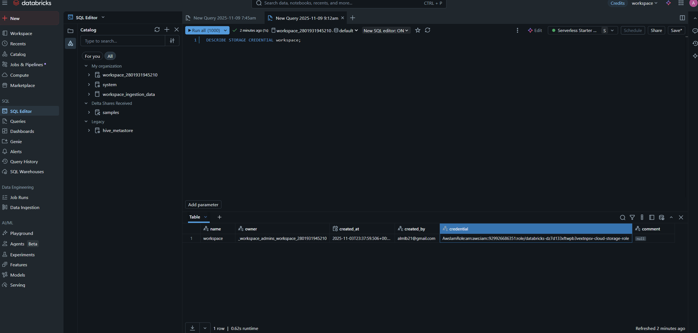
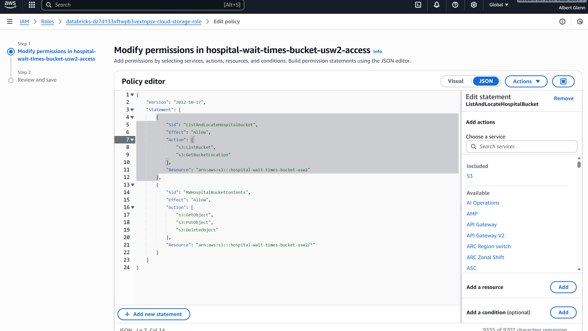
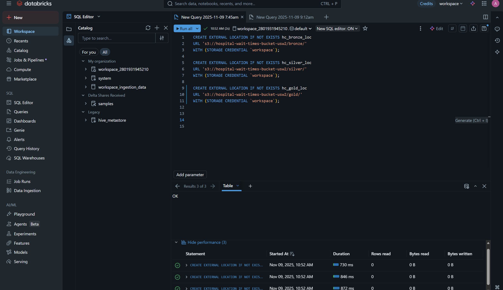

  
  
  
  

<h1 align="center">🏥 Troubleshooting AWS IAM “Permission Denied” in Databricks</h1>

  <i>Real-world debugging of a Databricks + AWS S3 integration issue during my Healthcare Wait Time Data Engineering Project</i>

---

# 🏥 Troubleshooting AWS IAM "Permission Denied" in Databricks

This repository documents how I resolved a **PERMISSION_DENIED** error between **Databricks** and **AWS S3** while building my **Healthcare Wait Time Data Engineering Project**.  

The issue occurred while creating **external locations (Bronze, Silver, Gold layers)** in Databricks using **Unity Catalog**.

---

## 🚨 Problem Overview

When I attempted to create external locations in Databricks, I kept seeing the following error:

bash
PERMISSION_DENIED: AWS IAM role does not have READ permissions on s3://hospital-wait-times-bucket-usw2/bronze

### ❌ Initial Error Message

Before fixing the IAM permissions, Databricks showed this error:

## 📸 Visual Summary

Here’s a visual walkthrough of how I identified and fixed the Databricks + AWS IAM permission issue step by step 👇🏾  

| 🧭 Step 1 — Identify the IAM Role | 🔐 Step 2 — Update IAM Policy | ✅ Step 3 — Validate in Databricks |
|----------------------------------|-------------------------------|-----------------------------------|
|  |  |  |

**Step 1:** Ran `DESCRIBE STORAGE CREDENTIAL workspace;` in Databricks SQL to identify the IAM role being used.  
**Step 2:** Updated the IAM policy in AWS to grant access to my `hospital-wait-times-bucket-usw2`.  
**Step 3:** Re-ran the SQL queries in Databricks to create external locations — all succeeded instantly ✅  

